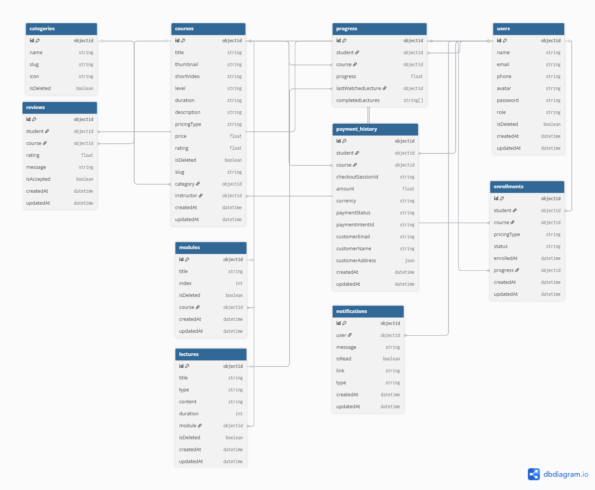

# 📚 Edu Sphere Backend (E-Learning Platform)

A full-featured online learning platform built using **Node.js**, **Express.js**, **MongoDB**, and **Mongoose**. It supports student enrollment, instructor course management, admin control panel, Stripe payment integration and **live notifications**.

---

## 🚀 Features

### 🔐 Role-Based Access Control

-   **Student**: Can browse courses, purchase them, and track learning progress.
-   **Instructor**: Can manage modules and lectures within their assigned courses.
-   **Admin**: Has full access to manage users, assign instructors, and create/edit courses, modules, and lectures.

### 🎓 Course Management

-   Create and manage multiple courses under categories.
-   Each course contains:
    -   Multiple modules
    -   Each module includes several lectures (text, video, etc.)

### 💳 Secure Payment Integration

-   **Stripe** used for secure, real-time course payments.
-   Webhook-based post-payment enrollment and notification system.

### 📊 Student Progress Tracking

-   Students can view and track lecture completion status.
-   Lectures unlock sequentially or based on progress logic.

---

## 🧠 Technologies Used

| Tech           | Description           |
| -------------- | --------------------- |
| **Node.js**    | JavaScript runtime    |
| **Express.js** | Backend framework     |
| **MongoDB**    | NoSQL database        |
| **Mongoose**   | MongoDB ODM           |
| **Stripe**     | Payment processing    |
| **JWT**        | Secure authentication |
| **Bcrypt**     | Password hashing      |
| **Cloudinary** | Media/image upload    |

---

---

## 🔐 Authentication & Authorization

-   **JWT** based login system.
-   Middleware to protect routes based on user roles.
-   Login/Register endpoints available for all users.

---

## 🛒 Payment Flow

-   Student selects a course to purchase.
-   Redirected to Stripe checkout session.
-   On successful payment, webhook triggers:
    -   Enrollment creation
    -   Notification generation
-   Course access is granted instantly.

---

## 👨‍🏫 User Roles & Permissions

| Role       | Capabilities                                                               |
| ---------- | -------------------------------------------------------------------------- |
| Student    | Browse courses, purchase, view progress                                    |
| Instructor | Manage modules and lectures in assigned courses                            |
| Admin      | Full access: manage users, courses, assign instructors, update roles, etc. |

---

## 📈 Progress Tracking

-   Students see completed lectures visually.
-   Backend stores and updates progress after each lecture completion.
-   Ensures lectures are accessed sequentially.

---

## Database Preview



## ⚙️ Setup Instructions

### 1. Clone the Repository

```bash
git clone https://github.com/NiharMondal/edu-sphere-backend
cd edu-sphere-backend
```

### 2. Install Dependencies

```bash
npm install
```

### 3. Configure Environment Variables

Create a **.env** file in the root directory and add:  
`NODE_ENV`  
`FRONT_END_URL` = "http://localhost:3000" //change when it is on production  
`MONGO_URI`  
`jwt config`  
`ACCESS_TOKEN_SECRET`  
`REFRESH_TOKEN_SECRET`  
`ACCESS_TOKEN_EXPIRE`  
`REFRESH_TOKEN_EXPIRE`  
`STRIPE_SECRET_KEY`  
`STRIPE_WEBHOOK_SECRET`

### 4. Run the Server

```bash
npm run dev
```

## 🙋‍♂️ Author

Nihar Mondal

Feel free to connect or contribute to the project!  
GitHub: https://github.com/NiharMondal
